# Báo cáo bài tập cuối kỳ môn Lập trình thiết bị di động

## 1) Thông tin chung

- Môn học: Lập trình thiết bị di động
- Đề tài: Xây dựng ứng dụng di động đa màn hình với Flutter
- Sinh viên thực hiện: Phan Minh Lãm
- Mã số sinh viên: 25TH0029
- Học kỳ: 2
- Giảng viên hướng dẫn: Huỳnh Tuấn Anh

## 2) Lý thuyết

### 2.1 Các nền tảng lập trình di động

Trong môn học, các nền tảng và hướng tiếp cận được tìm hiểu gồm:

- Native Android (Java/Kotlin): hiệu năng cao, truy cập API hệ thống đầy đủ, nhưng phát triển riêng từng nền tảng.
- Native iOS (Swift/Objective-C): tối ưu cho hệ sinh thái Apple, nhưng cần code riêng so với Android.
- Cross-platform:
	- Flutter: một codebase cho Android/iOS/Web/Desktop, UI theo kiểu declarative, hot reload nhanh.
	- React Native: sử dụng JavaScript/TypeScript, cấu trúc component, có khả năng mở rộng thông qua native module.

So sánh tổng quan:

- Native phù hợp bài toán cần tối ưu sâu vào từng hệ điều hành.
- Flutter phù hợp bài toán làm ứng dụng đa nền tảng nhanh, giao diện đồng bộ, dễ mở rộng.

### 2.2 Lập trình di động với Flutter

Những nội dung cốt lõi đã học và áp dụng vào bài:

- Cấu trúc ứng dụng Flutter:
	- Hàm main, runApp.
	- StatelessWidget và StatefulWidget.
- Xây dựng giao diện:
	- Widget cơ bản: Text, Image, Icon, Button, TextField.
	- Layout: Row, Column, Expanded, SizedBox, GridView, ListView.
- Điều hướng:
	- Navigator, MaterialPageRoute.
- Quản lý trạng thái:
	- SetState.
	- GetX (GetBuilder, Controller).
- Bất đồng bộ:
	- async/await, FutureBuilder, xử lý dữ liệu từ backend.
- Dữ liệu và backend:
	- Supabase Authentication.
	- CRUD với bảng dữ liệu Fruit.
	- Upload/Update hình ảnh lên Supabase Storage.

## 3) Ứng dụng đã cài đặt

### 3.1 Tổng quan ứng dụng

Ứng dụng là bộ sưu tập các bài tập thực hành theo từng chương trong môn học, gồm:

- Trang chủ menu tổng hợp các bài.
- Nhóm bài giao diện cơ bản.
- Nhóm bài state management (GetX).
- Nhóm bài backend (Supabase) theo mô hình của cửa hàng trái cây.

### 3.2 Danh sách bài tập/chức năng đã hoàn thành

#### A. Nhóm giao diện và điều hướng

- My Profile
	- Hiển thị thông tin cá nhân.
	- Chọn ngày sinh.
	- Chọn giới tính.
	- Chọn ngôn ngữ lập trình yêu thích.
- About
	- Màn hình thông tin.
- My Canon
	- GridView hình ảnh.
	- Xem ảnh lớn bằng CarouselSlider.

#### B. Nhóm state management

- GetX Counter
	- Controller GetX với increment/decrement.
	- Cập nhật UI theo ID GetBuilder.

#### C. Nhóm data/backend (Supabase)

- Fruit Store (xem sản phẩm)
	- Tải danh sách trái cây từ Supabase.
	- Hiển thị theo dạng lưới.
- Fruit Store (mở rộng)
	- Trang chi tiết sản phẩm.
	- Giỏ hàng: thêm, tăng/giảm số lượng, xóa, tính tổng tiền.
- Login + Verify OTP
	- Đăng nhập/đăng ký email với Supabase Auth UI.
	- Xác thực OTP email.
- Fruit Store Admin
	- Thêm sản phẩm.
	- Sửa sản phẩm.
	- Upload/cập nhật ảnh sản phẩm trên Supabase Storage.

## 4) Ứng dụng mở rộng để đạt điểm tối đa

Những nội dung mở rộng so với bài mẫu cơ bản:

- Tích hợp backend cloud thực tế (Supabase) thay vì dữ liệu tĩnh.
- Có luồng Authentication + OTP cho người dùng.
- Tách nhỏ domain Fruit thành model, controller, page.
- Có module quản trị (Admin) để thao tác dữ liệu.
- Giỏ hàng có xử lý nghiệp vụ cơ bản (chọn sản phẩm, cập nhật số lượng, tính tổng).
- Có sử dụng package thứ ba trong hệ sinh thái Flutter:
	- get
	- supabase_flutter
	- supabase_auth_ui
	- image_picker
	- flutter_slidable
	- flutter_rating_bar
	- carousel_slider
	- badges

## 5) Công nghệ sử dụng

- Ngôn ngữ: Dart
- Framework: Flutter
- State management: GetX
- Backend as a Service: Supabase
- IDE: VS Code
- Nền tảng đã test:
	- Android Emulator (API 35)
	- Windows

## 6) Cấu trúc thư mục chính

- lib/main.dart: điểm vào ứng dụng, khởi tạo Supabase
- lib/page_home.dart: menu tổng hợp bài tập
- lib/page_proflie.dart: bài tập profile
- lib/page_image_gridview.dart: bài tập GridView + Carousel
- lib/getx: bài tập GetX
- lib/supabase_app: bài tập backend (Fruit Store, Login, Admin)

## 7) Hướng dẫn chạy dự án

### 7.1 Yêu cầu môi trường

- Flutter SDK 3.41.x trở lên
- Android SDK + Android Emulator
- JDK từ Android Studio (jbr)

### 7.2 Các bước chạy

1. Cài package:

```bash
flutter pub get
```

2. Kiểm tra môi trường:

```bash
flutter doctor -v
```

3. Khởi động emulator Android.

4. Chạy ứng dụng:

```bash
flutter run -d emulator-5554
```

Hoặc chạy nhanh trên web/desktop:

```bash
flutter run -d chrome
flutter run -d windows
```

## 8) Chứng minh kết quả

### 8.1 Danh sách màn/chức năng đã kiểm thử

- Home (menu tổng hợp)
- My Profile (thông tin cá nhân)
- About
- My Canon (GridView + Carousel)
- GetX Counter
- Fruit Store (danh sách + chi tiết)
- Giỏ hàng (thêm/xóa/cập nhật số lượng)
- Login/Sign up + Verify OTP
- Fruit Admin (thêm/sửa sản phẩm, upload ảnh lên Supabase Storage)

### 8.2 Hình ảnh minh chứng

#### Home và giao diện cơ bản

<p align="center">
	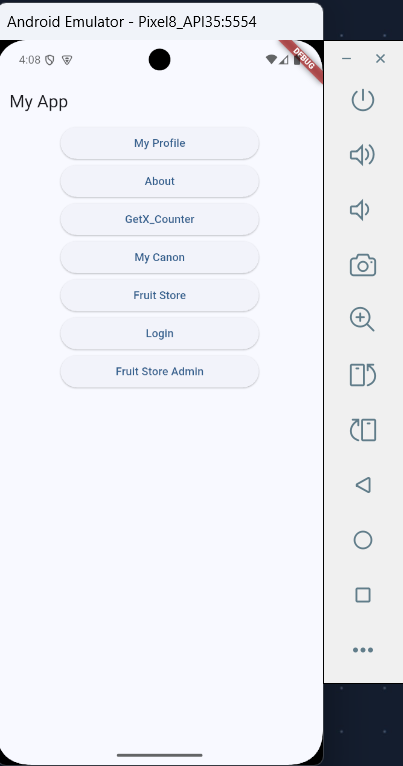
	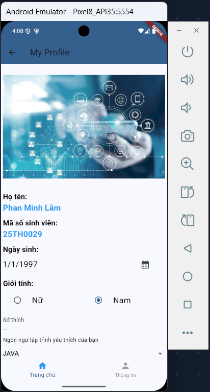
	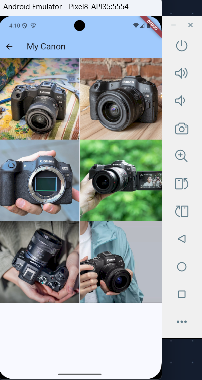
</p>

<p align="center">
	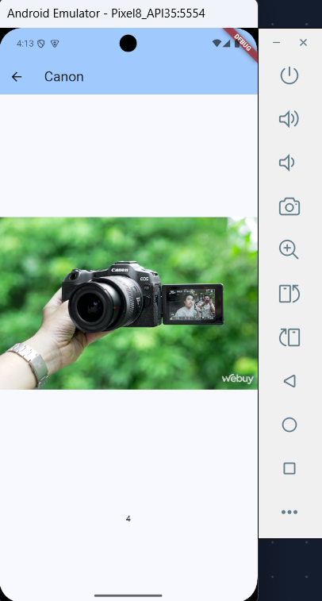
</p>

- Home: màn hình menu tổng hợp các bài tập.
- My Profile: màn hình thông tin cá nhân, ngày sinh, giới tính và ngôn ngữ yêu thích.
- My Canon: hiển thị GridView hình ảnh và xem ảnh chi tiết theo dạng slider.

#### State management với GetX

<p align="center">
	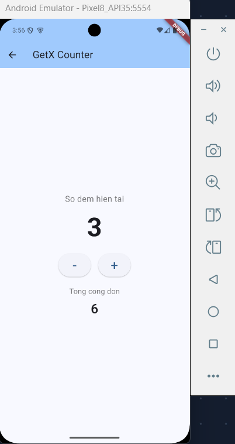
</p>

- GetX Counter: minh họa Controller, GetBuilder và cập nhật giao diện theo trạng thái.

#### Supabase và Fruit Store

<p align="center">
	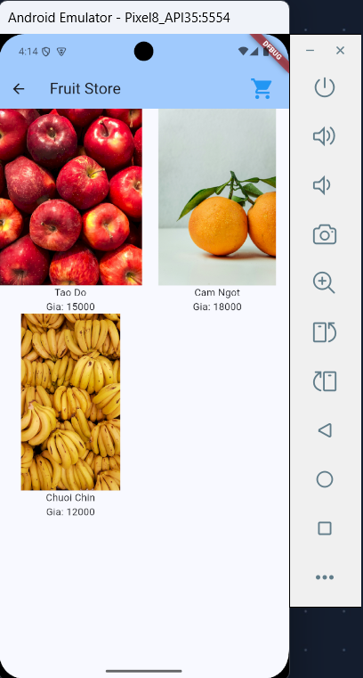
	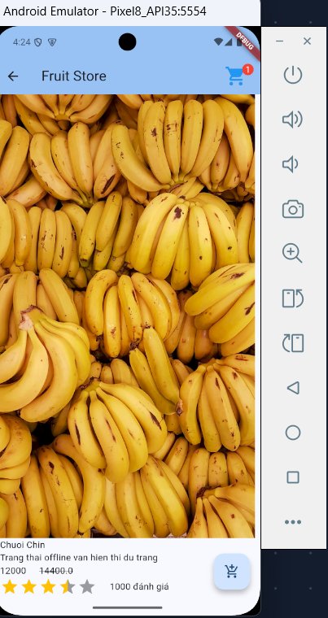
	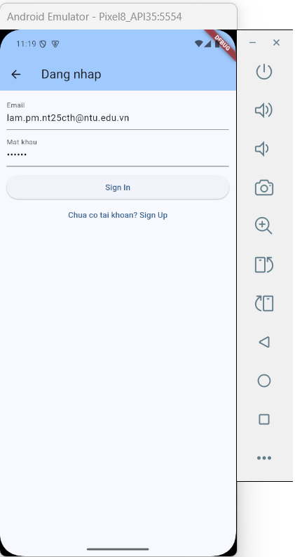
</p>

<p align="center">
	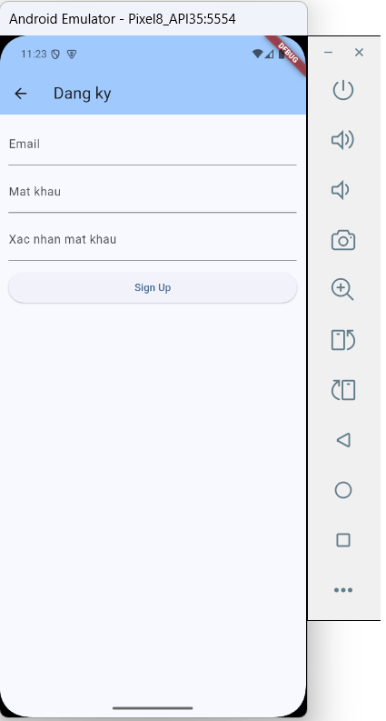
	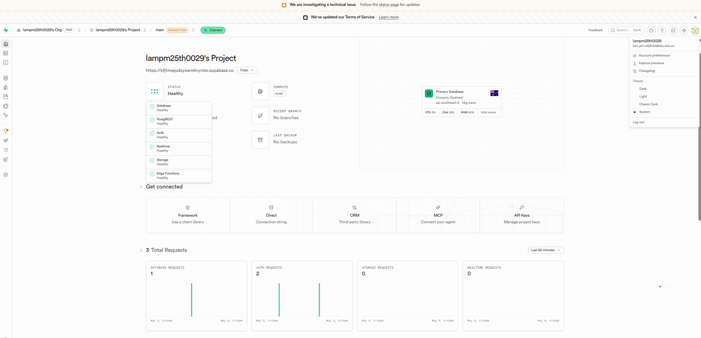
</p>

- Fruit Store: tải danh sách trái cây từ Supabase và hiển thị theo dạng lưới.
- Giỏ hàng: thêm sản phẩm, thay đổi số lượng và tính tổng tiền.
- Đăng nhập/Đăng ký: sử dụng Supabase Auth UI và xác thực OTP qua email.

#### Chức năng quản trị và quy trình đặt hàng

<p align="center">
	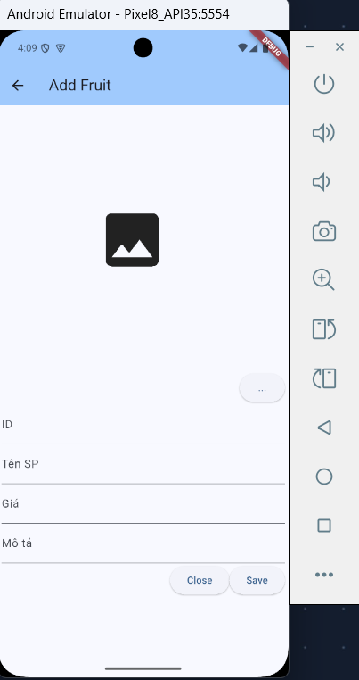
	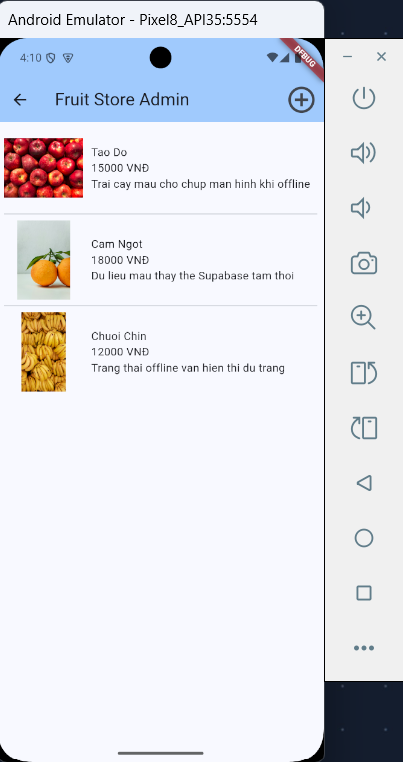
	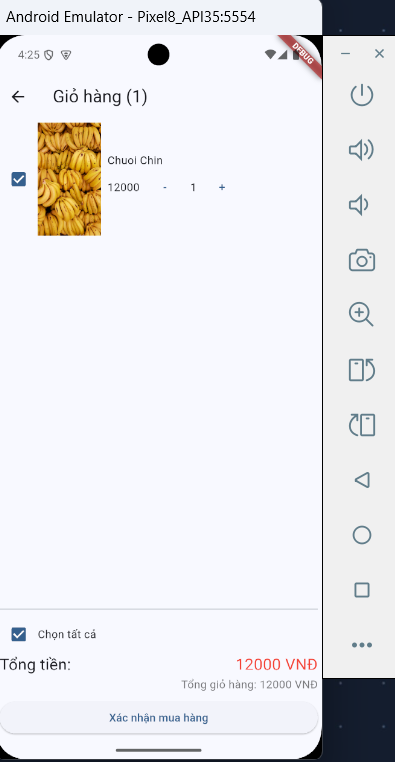
</p>

<p align="center">
	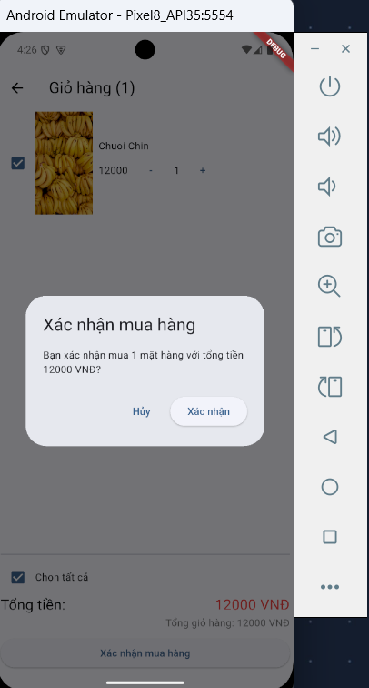
	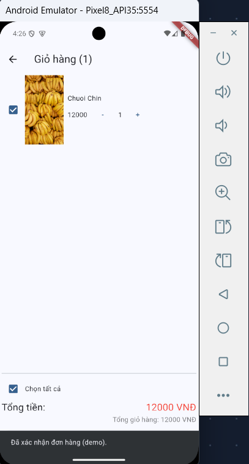
</p>

- Fruit Admin: thêm/sửa sản phẩm và cập nhật hình ảnh lên Supabase Storage.
- Quy trình đặt hàng: xác nhận mua hàng và hiển thị trạng thái đơn hàng sau khi hoàn tất thao tác.

## 9) Đánh giá kết quả

- Đã áp dụng đủ các nội dung trong môn:
	- UI cơ bản
	- Điều hướng
	- State management (GetX)
	- Bất đồng bộ
	- Data/backend cloud
- Dự án đã được kiểm tra analyzer:
	- flutter analyze -> No issues found

## 10) Hướng phát triển tiếp theo

- Hoàn thiện giao diện theo chuẩn responsive và design system.
- Bổ sung validate form đầy đủ khi thêm/sửa sản phẩm.
- Thêm phân quyền user/admin rõ ràng hơn.
- Viết test cho một số luồng logic quan trọng (controller, service).

## 11) Tài liệu tham khảo

- Tài liệu bài giảng trong thư mục Bai_Giang:
	- Introduction.pdf
	- Dart.pdf
	- Dart_Async.pdf
	- UI.pdf
	- State_Management.pdf
	- GetX_StateManagement.pdf
	- Data_Backend.pdf
	- Contents_Device.pdf
	- React_Native_From_Flutter.pdf
- Flutter docs: https://docs.flutter.dev
- Dart docs: https://dart.dev
- Supabase docs: https://supabase.com/docs